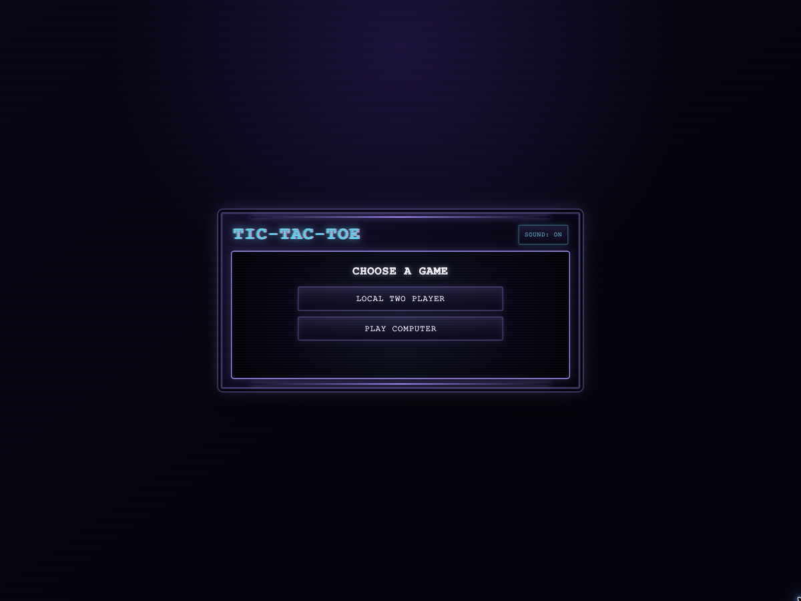
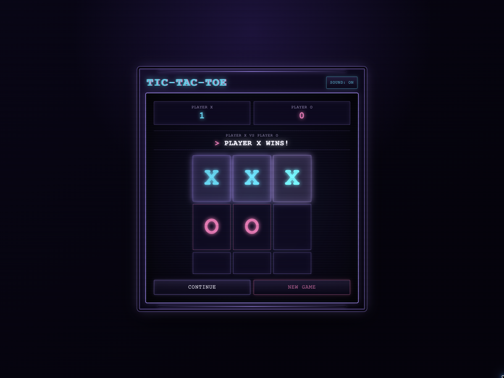

# Neon Arcade Tic-Tac-Toe

A dependency-free browser game for local two-player matches or games against the computer. It combines complete tic-tac-toe rules and series scoring with a responsive Neon Arcade interface, Retro CRT effects, synthesized sound, and accessible controls.

## Screenshots

| Game setup | Winning round |
| --- | --- |
|  |  |

## Features

- Local two-player and player-versus-computer modes
- Easy, Medium, and unbeatable Hard computer difficulties
- Choice of playing as X or O against the computer
- X-first rounds with win, draw, and invalid-move detection
- Series scoring with Continue, Restart, and New Game controls
- Cyan and magenta Neon Arcade styling with CRT scanlines
- Responsive layouts for phones and larger screens
- Reduced-motion support
- Synthesized move sounds, win jingle, draw tone, and mute control
- In-memory state that resets when the page is refreshed

## Prerequisites

- A modern web browser
- Python 3 for the local development server
- Node.js and npm to run the automated tests

The game has no runtime dependencies and does not require `npm install`.

## Run Locally

From the project directory, start a static HTTP server:

```sh
python3 -m http.server 8000
```

Open [http://localhost:8000](http://localhost:8000) in your browser.

## How to Play

1. Choose **Local Two Player** or **Play Computer**.
2. For a computer game, select a difficulty and choose X or O.
3. Select an empty cell to place the current mark. X always starts each round.
4. After a completed round:
   - **Continue** starts another round with the same setup and scores.
   - **New Game** clears the scores and returns to game setup.
5. During an active round, **Restart** clears the board without changing the setup or scores.

Use **Sound: On/Off** to control audio for the current page session. The board and controls work with mouse, touch, and keyboard activation.

## Computer Difficulties

| Difficulty | Behavior |
| --- | --- |
| Easy | Chooses randomly from the legal cells. |
| Medium | Takes an immediate win, blocks an immediate loss, then chooses from legal cells. |
| Hard | Uses optimal play and cannot be defeated. |

## Tests

Run the complete automated suite:

```sh
npm test
```

The tests cover game rules, all eight winning lines, draws, scoring, round resets, computer strategies, interface structure, responsive styling, animation hooks, and synthesized audio scheduling.

## Project Structure

```text
.
├── assets/screenshots/     # Game setup and completed-round screenshots
├── index.html              # Semantic game interface and controls
├── style.css               # Neon Arcade theme, layout, and motion
├── script.js               # Game state, rules, computer play, rendering, and audio
├── SPEC.md                 # Completed product specification and verification checklist
├── package.json            # Node test command and ES module configuration
└── tests/
    ├── audio.test.js       # Synthesized sound and mute behavior
    ├── interface.test.js   # HTML structure and accessibility hooks
    ├── motion.test.js      # Animation and reduced-motion behavior
    ├── phone-frame.html    # Reproducible phone-sized browser fixture
    ├── script.test.js      # Game rules, scoring, and computer strategies
    └── style.test.js       # Theme and responsive CSS checks
```

## Accessibility

- The board uses native buttons with descriptive cell labels.
- Game status updates are announced through a polite live region.
- Sound state is exposed through visible text and `aria-pressed`.
- Keyboard focus uses a high-contrast neon outline.
- Decorative animations are disabled when reduced motion is requested.

## Implementation Notes

All game state is held in memory. `script.js` exports the game-rule and computer-move functions so they can be tested directly without a browser. Audio is generated at runtime with the Web Audio API, so no media assets are required.
